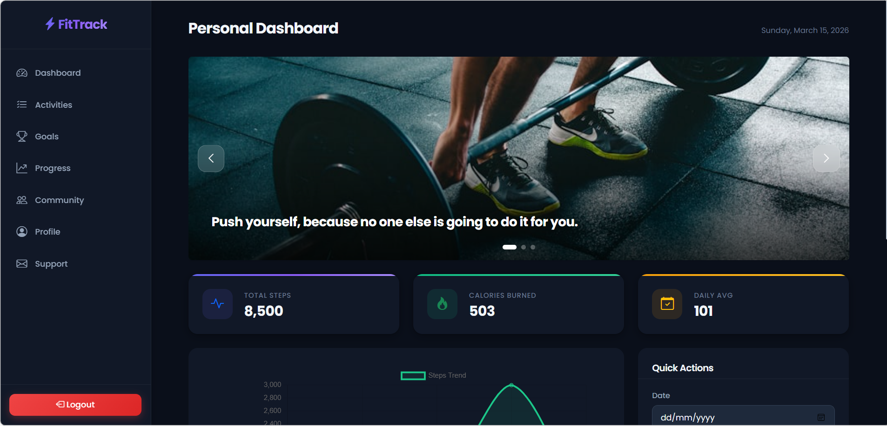
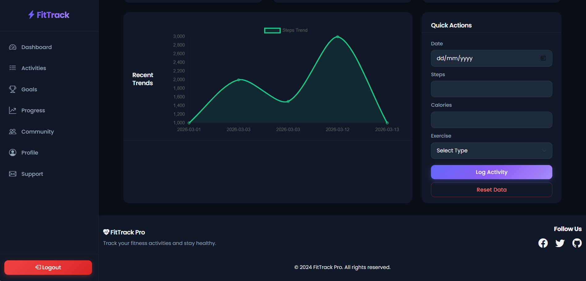
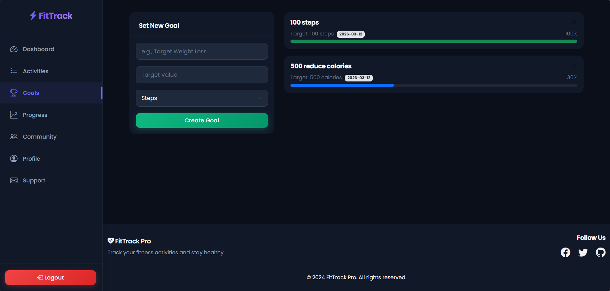
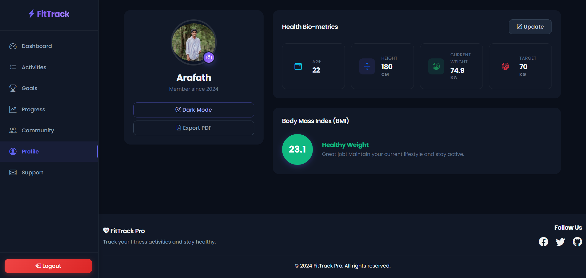
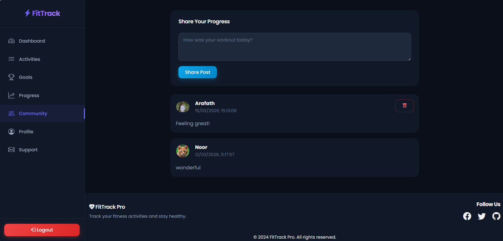
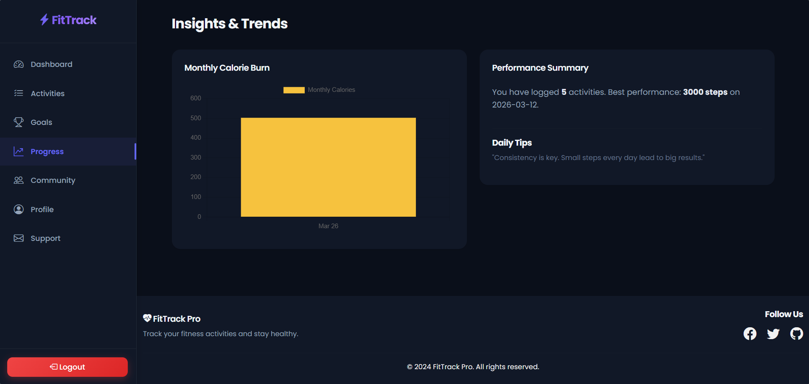
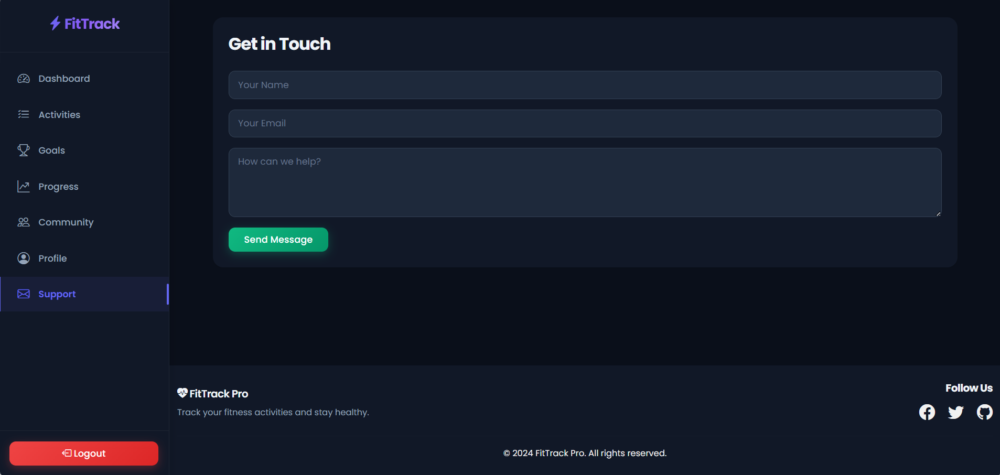

# FitTrack Pro

**Course:** ICT 2204 — Web Design and Technologies  
**Phase 2:** Frontend  
**Students:** Mohamed Arafath (ICT/2023/142) · Inun Nooriyya (ICT/2023/112)  
**University:** Rajarata University of Sri Lanka

---

## About

**FitTrack Pro** is an advanced fitness tracking web application that allows users to monitor daily activities, set fitness goals, track progress, and engage with a fitness community. It is designed to help users stay healthy, motivated, and achieve their personal fitness goals.

---

## Features

- **User Authentication:** Sign up, login, and secure password management.
- **Profile Setup:** Input age, height, weight, and target weight.
- **Dashboard:** View total steps, calories burned, daily averages, and motivational slider.
- **Activity Logging:** Add daily activities with steps, calories, and exercise type.
- **Goals Management:** Set and track fitness goals for steps or calories.
- **Progress Insights:** View charts for weekly steps, monthly calories, and BMI.
- **Community:** Share progress and posts with other users.
- **Profile Management:** Update profile info, profile picture, and enable dark mode.
- **Support:** Contact page with email integration via EmailJS.

---

## Screenshots

 
  
  
  
 

---

## Tech Stack

- **Frontend:** HTML5, CSS3, Bootstrap 5, JavaScript  
- **Charts & Visualization:** Chart.js  
- **Email Integration:** EmailJS  
- **PDF Export:** jsPDF  
- **Icons:** Bootstrap Icons  
- **Responsive Design:** Mobile-friendly and cross-browser compatible
											

---

## Folder Structure

FitTrack Pro/
│
├── index.html            # Main HTML file
├── styles.css            # Main CSS file
├── app.js                # Main JavaScript logic
├── README.md             # Project documentation
│
├── screenshots/          # Screenshots for README
│   ├── Activity_log.png
│   ├── Community.png
│   ├── Dashboard_01.png
│   ├── Dashboard_02.png
│   ├── Goals.png
│   ├── Profile.png
│   ├── Progress.png
│   └── Support.png
│
└── js/                   # JavaScript modules
    ├── storage.js
    ├── auth.js
    ├── activity.js
    ├── goals.js
    └── ui.js

---

## How to Run
1. Download or clone the repository
2. Open `index.html` in a browser
3. No server required for Phase 2
